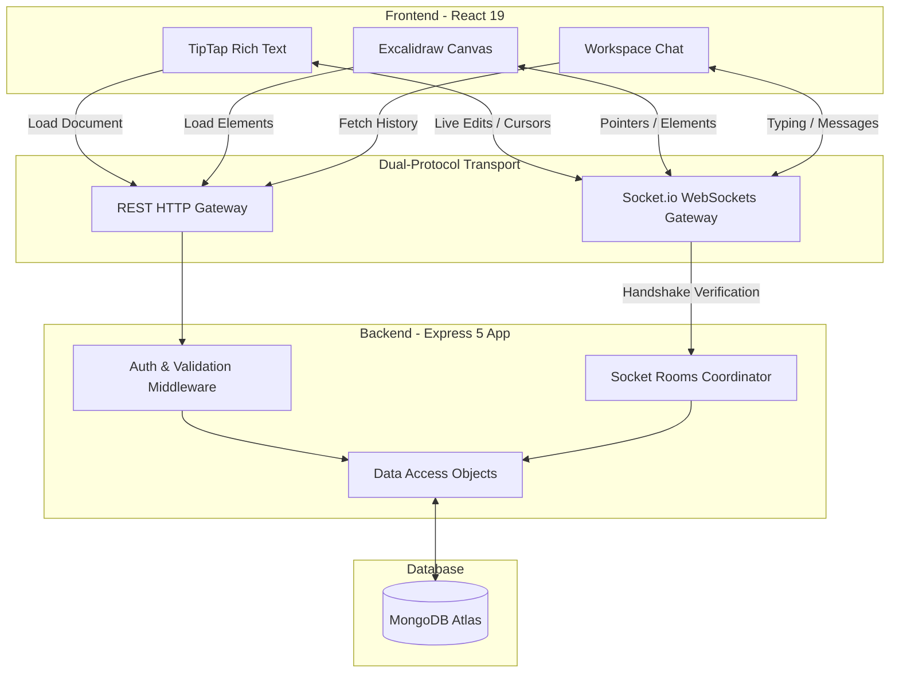

# 🪶 Quill: Real-Time Collaborative Workspace

Quill is a high-fidelity, full-stack collaborative workspace platform designed for teams to brainstorm, draft documents, design diagrams, and chat in real time. Combining a headless rich-text editor, a vector-based diagram canvas, and workspace-wide channels, Quill provides a unified hub for team productivity.

---

## 🚀 Key Features

### 1. ✍️ Dual-Nature Collaborative Editor
- **Rich-Text Mode (TipTap)**: Fully collaborative headless text editor powered by ProseMirror, supporting formatting (bold, italic, lists, quotes, code blocks) and real-time document saves.
- **Visual Diagram Mode (Excalidraw)**: Interactive whiteboard canvas for designing architecture diagrams, mind maps, and wireframes in real time.
- **Real-Time Selections & Pointers**: Syncs active text carets (from/to positions) and canvas pointers (coordinates, button states, and stable user colors) with other collaborators at 60 FPS.
- **Typing Guard Engine**: Implements an active keystroke guard (`1200ms` window) that defers incoming remote synchronization blocks while a user is typing, preventing cursor jumps and text overwrites.

### 2. 💬 Real-Time Workspace Chat
- **Workspace Channels**: Dedicated general channels scoped to specific workspaces.
- **Live Sync Messages**: Full CRUD operations on chat messages (Send, Edit, Delete) with immediate Socket.io broadcasts.
- **Typing Indicators**: Bouncing indicators showing which team members are currently composing a message.
- **Active Members List**: Dynamic updates showing which workspace members are currently online in the chat lobby.

### 3. 🛡️ Granular Workspace Management
- **Workspaces**: Group documents, drawings, and discussions into independent workspaces.
- **Invite Engine**: Generate invite codes for team members to join private workspaces seamlessly.
- **Visibility Toggles**: Switch workspaces between `public` and `private` visibility rules.

---

## 🛠️ Tech Stack Breakdown

### Frontend (Client)
- **Framework**: React 19 (Concurrent rendering hooks)
- **Bundle & Tooling**: Vite
- **Styling**: Tailwind CSS v4 (Compiler-based, low runtime footprint)
- **Server Cache State**: TanStack React Query v5 (Auto-refetching, query mutations, optimistic UI updates)
- **Global State**: Redux Toolkit (RTK) (Auth credentials, global UI settings)
- **Libraries**: Lucide-React, React-Router v7, Socket.io-client

### Backend (Server)
- **Framework**: Express 5
- **Real-time Engine**: Socket.io (Namespaces, heartbeats, automatic reconnection, dynamic rooms)
- **Database (ODM)**: MongoDB + Mongoose
- **Security**: JWT Authentication (HTTP-Only Cookie storage), custom WebSockets handshake authentication middleware
- **Utilities**: Express-validator, bcryptjs, cookie-parser

---

## 📐 System Architecture



---

## ⚙️ Installation & Setup

### Prerequisites
- Node.js (v18 or higher)
- MongoDB Instance (Atlas URI or local server)

### 1. Clone & Set Up Directory
```bash
git clone https://github.com/few-4/Quill.git
cd Quill
```

### 2. Configure Backend
Navigate to the `Backend` directory:
```bash
cd Backend
npm install
```
Create a `.env` file inside the `Backend` folder using the variables below:
```env
PORT=3000
MONGO_URI=mongodb+srv://<username>:<password>@cluster0.mongodb.net/quill
ACCESS_TOKEN_SECRET=your_jwt_access_secret_key
REFRESH_TOKEN_SECRET=your_jwt_refresh_secret_key
CORS_ORIGIN=http://localhost:5173
```
Run the backend in development mode:
```bash
npm run dev
```

### 3. Configure Frontend
Navigate to the `Frontend` directory in a new terminal window:
```bash
cd Frontend
npm install
```
Create a `.env` file inside the `Frontend` folder:
```env
VITE_BACKEND_URL=http://localhost:3000
```
Run the frontend development server:
```bash
npm run dev
```
Open [http://localhost:5173](http://localhost:5173) in your browser.

---

## 🔑 Core API Route References

### Authentication Router (`/api/auth`)
*   `POST /register` - Register a new user.
*   `POST /login` - Login, authenticates credentials, and issues HTTP-Only access cookies.
*   `POST /logout` - Clear cookies and terminate active user session.

### Workspace Router (`/api/workspace`)
*   `POST /create` - Establish a new workspace (Private Access).
*   `GET /all` - Fetch all workspaces the user participates in as owner or member.
*   `POST /join` - Join an existing workspace using a generated invite code.
*   `DELETE /:workspaceId` - Delete a workspace (Owner-only privilege).

### Document Router (`/api/document`)
*   `POST /create` - Create a new document (`type: "text"` or `type: "visual"`).
*   `GET /workspace/:workspaceId` - Retrieve all documents belonging to a workspace.
*   `GET /:docId` - Hydrate a single document's metadata and full JSON state.
*   `PATCH /:docId` - Rename a document.
*   `DELETE /:docId` - Delete a document.

### Messaging Router (`/api/message`)
*   `POST /:workspaceId` - Post a new message to the workspace channel.
*   `GET /:workspaceId` - Fetch paginated chat history.
*   `PUT /:messageId` - Edit a message.
*   `DELETE /:messageId` - Delete a message.

---

## 🔒 Security & Performance Gate Architectures
1.  **WebSocket Handshake Guard**: Every Socket connection is parsed at connection handshake via `io.use` to authenticate JWT tokens, denying unauthenticated socket queries from consuming connection slots.
2.  **Excalidraw Loop-Change Gate**: Calculates elements' version sums to distinguish between local changes and incoming socket updates, breaking state loop cycles.
3.  **Mongoose Compound Indexes**: Speeds sorting and filtering queries from linear searches to `O(log N)` index lookups using pre-sorted B-Trees:
    ```javascript
    documentSchema.index({ workspaceId: 1, updatedAt: -1 });
    messageSchema.index({ workspaceId: 1, createdAt: -1 });
    ```

---
